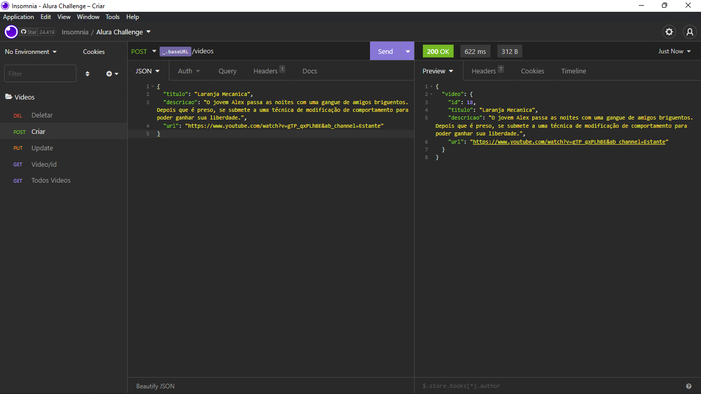
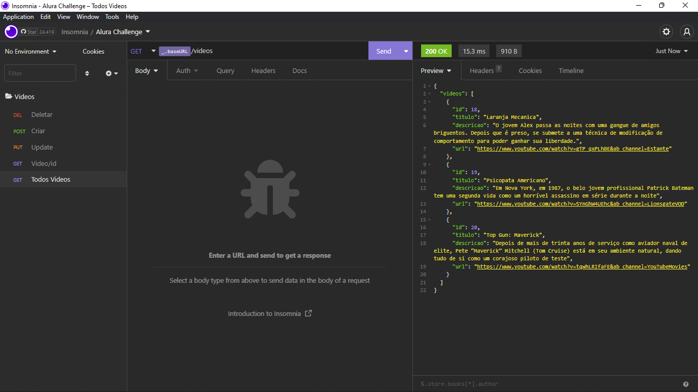
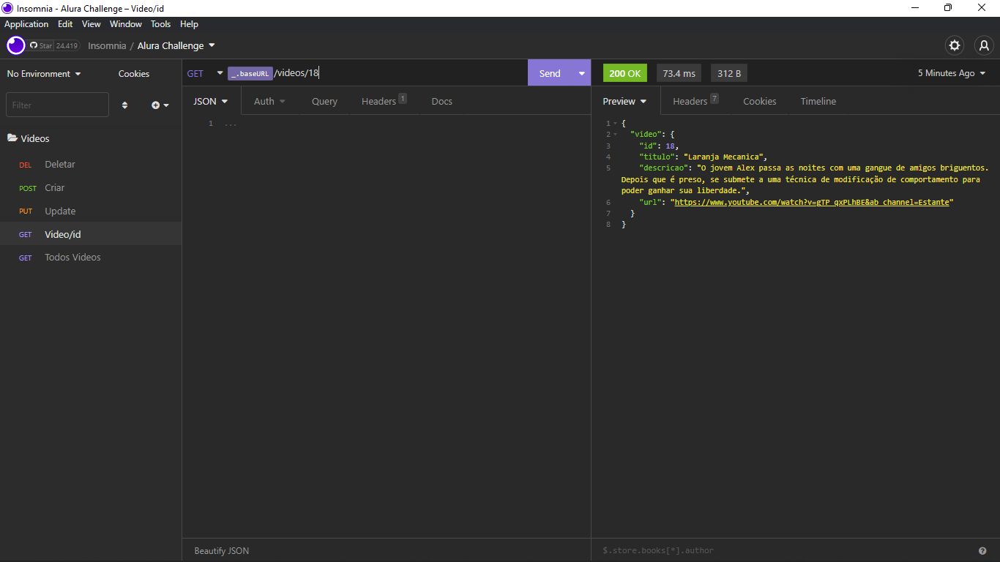
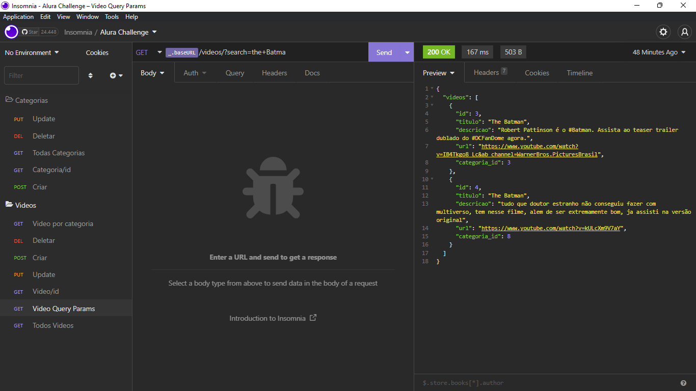
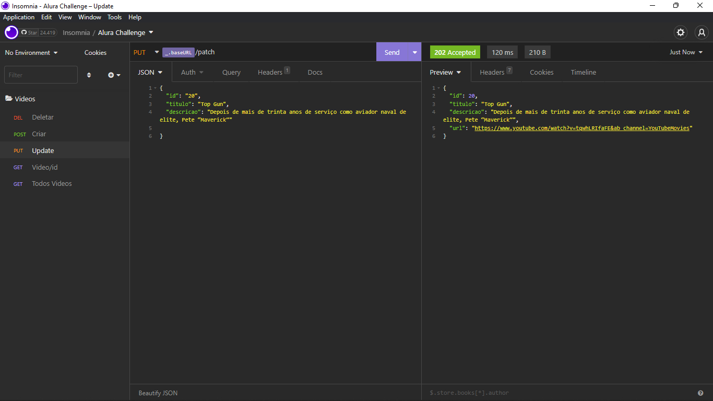
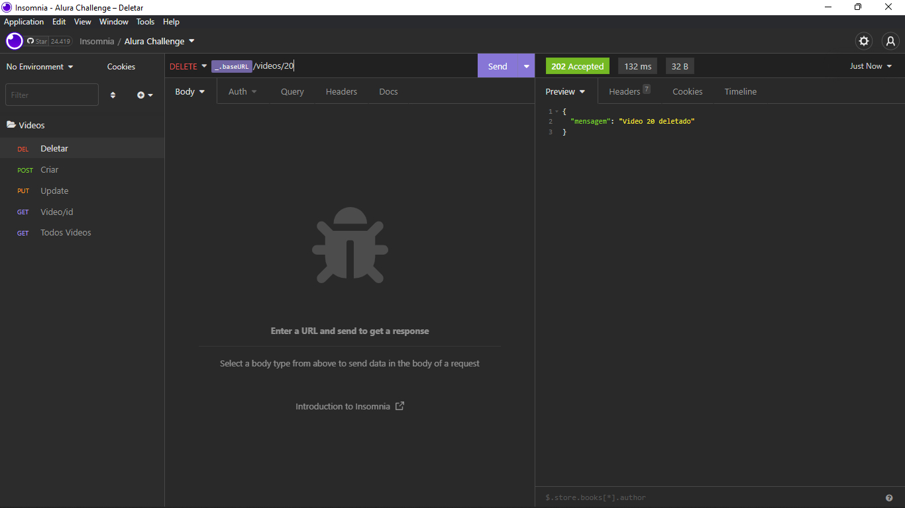
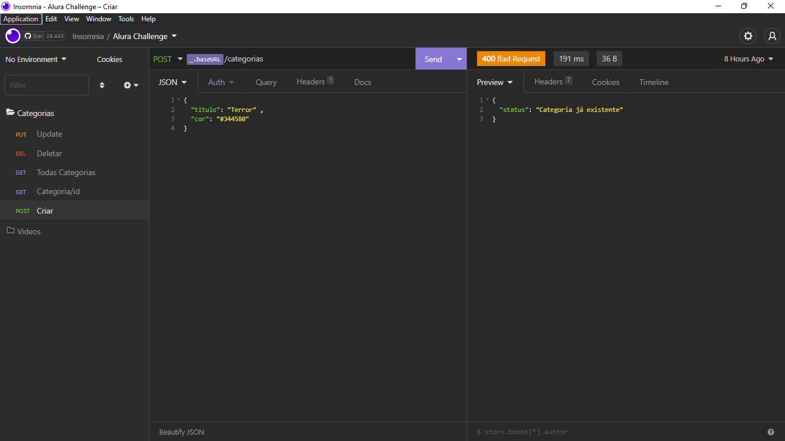
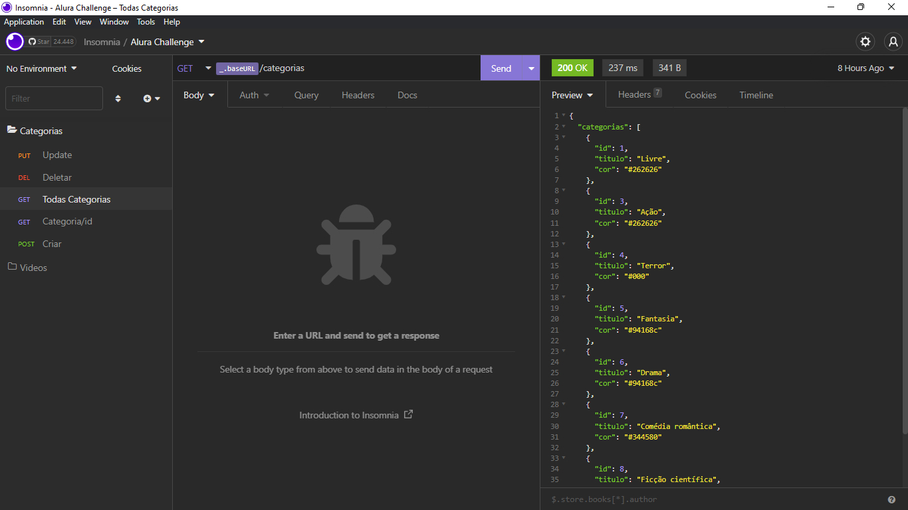
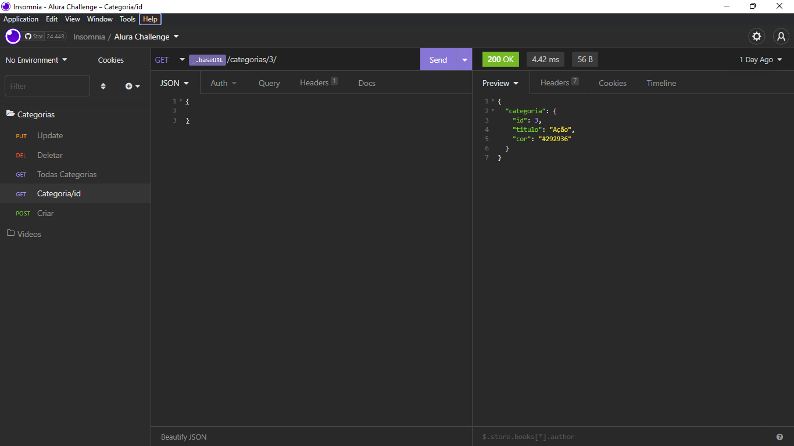

## Api Aluraflix
Essa API foi idealizada para o desafio back-end 5°.Com o objetivo de cadastrar novos vídeos em um banco de dados

## Tecnologias

Neste projeto foi utilizado

* Node Js
* Express 4.18.2
* Prisma 4.5.0

## Getting started

Seu primeiro passo será instalar as dependências

```
npm install
```

Logo apos a instalação basta conecte o prisma ao seu servidor mysql no arquivo, 
```
prisma/schema.prisma
```
alterando ao URL para a do seu banco
```
datasource db {
  provider = "mysql"
  url      = "SUA_URL"
}
```
# Rotas e exemplos

| Videos                                           | Categorias                                                |
| ------------------------------------------------ | --------------------------------------------------------- |
| [POST localhost:3000/videos](#PostVideo)         | [POST localhost:3000/categorias](#PostCategorias)         |
| [GET localhost:3000/videos](#GetAllVideos)       | [GET localhost:3000/categorias](#GetAllCategorias)        |
| [GET localhost:3000/videos/:id](#GetVideoById)   | [GET localhost:3000/categorias/:id](#GetCategoriasById)   |
| [PUT localhost:3000/videos](#PutVideo)           | [PUT localhost:3000/categorias](#PutCategorias)           |
| [DELETE localhost:3000/videos/:id](#DeleteVideo) | [DELETE localhost:3000/categorias/:id](#DeleteCategorias) |
| [GET localhost:3000/videos?query](#QueryVideo)   |                                                           |

<div id='PostVideo'/>

# Adicionar um video

```
POST localhost:3000/videos
```
O método post de /videos adiciona ao banco de dados um video com as seguintes características:
* Titulo
* Descrição
* URL

Todos eles sendo obrigatórios

Apos a insertação ao banco de dados a api retorna um JSON com o video




<div id='GetAllVideos'/>

# Ver todos os videos 


```
GET localhost:3000/videos
```
O metodo GET de /videos retorna um JSON com todos os videos no banco



<div id='GetVideoById'/>

# Ver video pelo ID

```
GET localhost:3000/videos/:id
```
O metodo GET de /videos/:id retorna um JSON com o video na com aquele id especifico



<div id='QueryVideo'/>

# Ver video pelo titulo via query parameters

```
GET localhost:3000/videos/?search="nome do filme"
```
Com esse metodo é possivel procurar um video via query parameters, ele retornará um json com todos os filmes com esse titulo




<div id='PutVideo'/>

# Atualizar video

```
PUT localhost:3000/videos
```
O metodo PUT de /videos retorna um JSON com o video com os campos atualizados. Único campo obrigatório é o ID, os demais campos a serem atualizados são opcionais



<div id='DeleteVideo'/>

# Deletar video

```
DELETE localhost:3000/videos/:id
```
O método DELETE de /videos/:id apaga permanentemente do banco o video indicado



#Categorias

<div id='PostCategorias'/>

# Adicionar uma categoria

```
POST localhost:3000/categorias
```
O método post de /categorias adiciona ao banco de dados um categoria com as seguintes características:

* titulo
* cor

Todos eles sendo obrigatórios

Apos a insertação ao banco de dados a api retorna um JSON com a categoria




<div id='GetAllCategorias'/>

# Ver todas as categorias


```
GET localhost:3000/categorias
```
O metodo GET de /categorias retorna um JSON com todas as categorias no banco



<div id='GetCategoriasById'/>

# Ver categoria pelo ID

```
GET localhost:3000/categorias/:id
```
O metodo GET de /categorias/:id retorna um JSON com a categoria na com aquele id especifico



<div id='PutCategorias'/>

# Atualizar categoria

```
PUT localhost:3000/categorias
```
O metodo PUT de /categorias retorna um JSON com o video com os campos atualizados. Único campo obrigatório é o ID, os demais campos a serem atualizados são opcionais


<div id='DeleteCategorias'/>

# Deletar Categoria

```
DELETE localhost:3000/categorias/:id
```
O método DELETE de /categorias/:id apaga permanentemente do banco a categoria indicada


## Autor

  * **Matheus Henryque Vinha** 

  Obrigado por visitar meu codigo! :kissing_heart:
