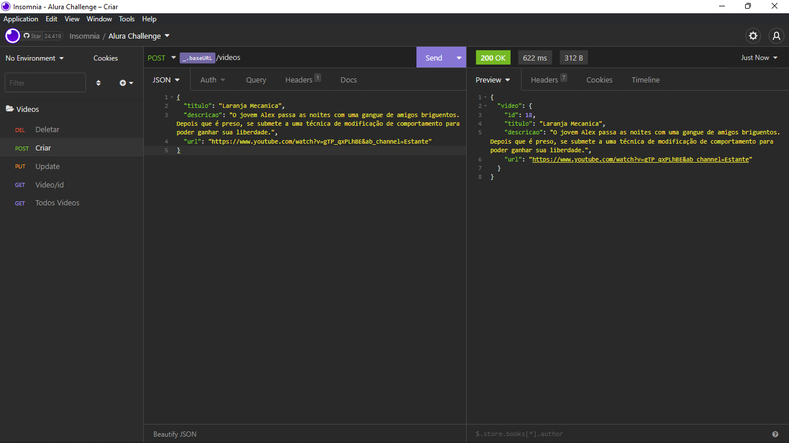
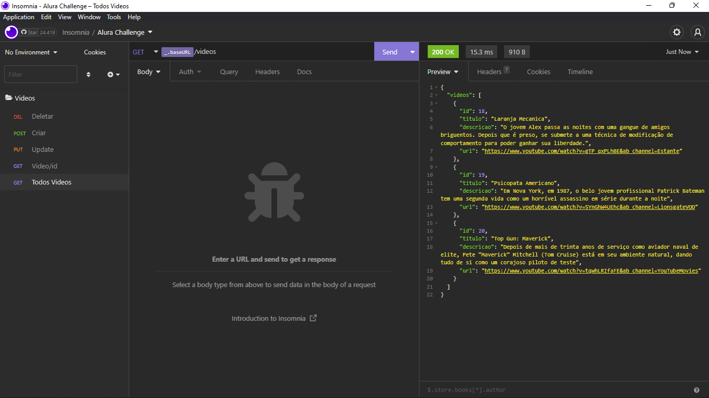
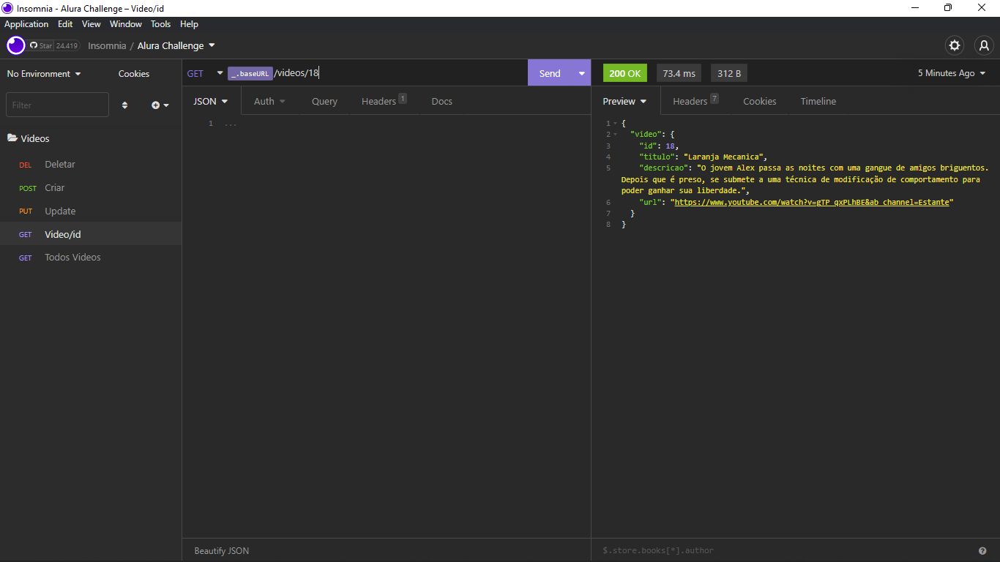
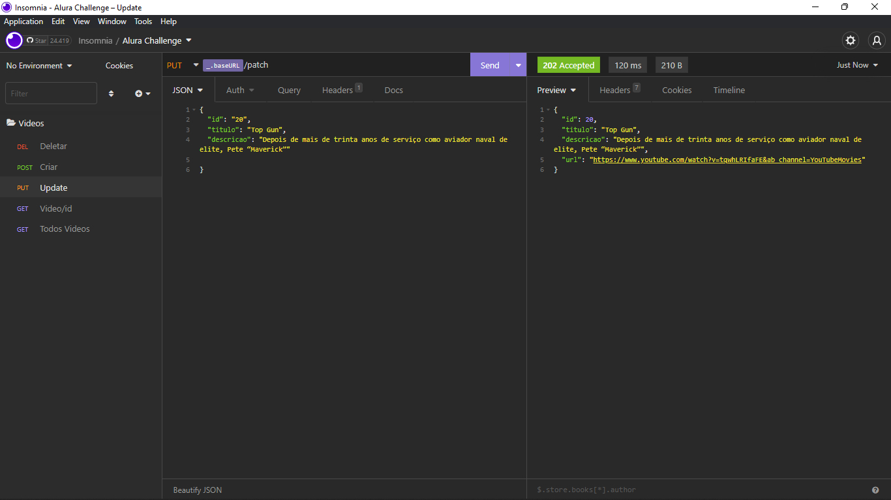
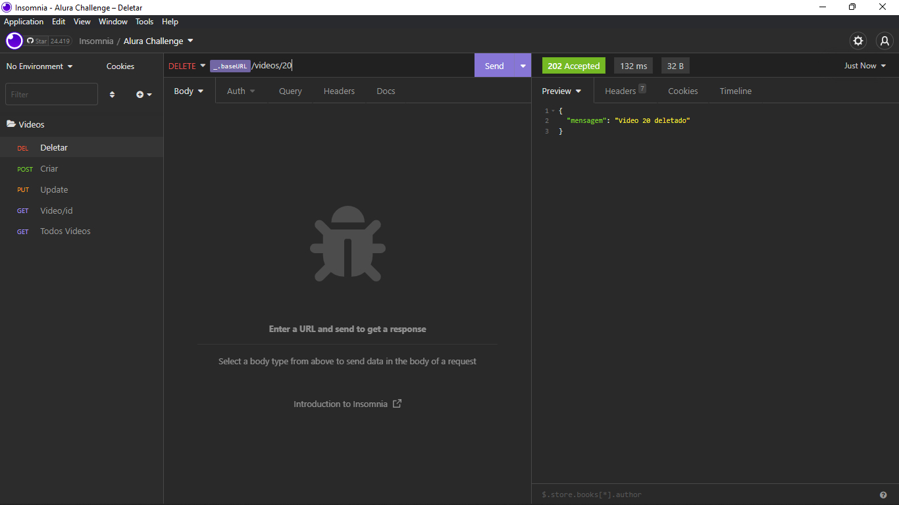

## Api Aluraflix
Essa API foi idealizada para o desafio back-end 5°.Com o objetivo de cadastrar novos vídeos em um banco de dados

## Tecnologias

Neste projeto foi utilizado

* Node Js
* Express 4.18.2
* Prisma 4.5.0

## Getting started

Seu primeiro passo será instalar as dependências

```
npm install
```

Logo apos a instalação basta conecte o prisma ao seu servidor mysql no arquivo, 
```
prisma/schema.prisma
```
alterando ao URL para a do seu banco
```
datasource db {
  provider = "mysql"
  url      = "SUA_URL"
}
```

## Caminhos


| Rotas       |
| ----------- |
| /videos     |
| /videos/:id |
| /patch      |


## Métodos, rotas e suas funcionalidades

### Adicionar um video

```
POST localhost:3000/videos
```
O método post de /videos adiciona ao banco de dados um video com as seguintes características:
* Titulo
* Descrição
* URL

Todos eles sendo obrigatórios

Apos a insertação ao banco de dados a api retorna um JSON com o video





### Ver todos os videos 

```
GET localhost:3000/videos
```
O metodo GET de /videos retorna um JSON com todos os videos no banco



### Ver video pelo ID

```
GET localhost:3000/videos/:id
```
O metodo GET de /videos/:id retorna um JSON com o video na com aquele id especifico




### Atualizar video

```
PUT localhost:3000/videos
```
O metodo PUT de /videos retorna um JSON com o video com os campos atualizados. Único campo obrigatório é o ID, os demais campos a serem atualizados são opcionais




### Deletar video

```
DELETE localhost:3000/videos
```
O método DELETE de /videos/:id apaga permanentemente do banco o video indicado



## Autor

  * **Matheus Henryque Vinha** 

  Obrigado por visitar meu codigo! :kissing_heart:
